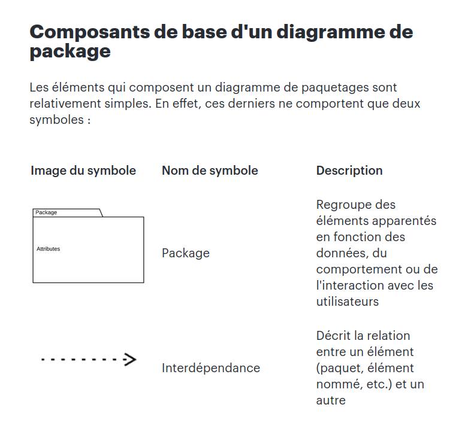
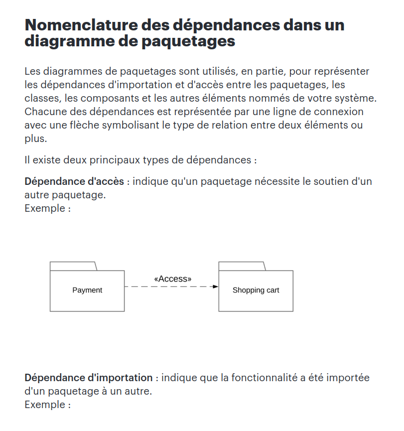
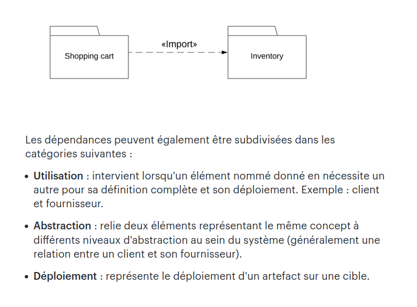

## Diagramme de Packages : structuration des éléments modélisés

**Objectif :** Créer des diagrammes de packages pour structurer les éléments modélisés dans un système de réservation de vols en ligne en utilisant le plugin UMLet pour Visual Studio.

### Groupement logique des éléments

Lors de la conception d'un système complexe, il est essentiel de structurer les éléments de manière logique et hiérarchique. Le diagramme de packages est utilisé pour représenter cette structure en regroupant des éléments similaires dans des packages. Les packages peuvent contenir des classes, des sous-packages, des interfaces, et d'autres éléments.

### Utilisation du diagramme de packages

Le diagramme de packages offre une vue globale de la structure organisationnelle du système. Il permet de visualiser comment les éléments sont regroupés en packages et comment ces packages interagissent entre eux. Voici comment vous pouvez utiliser le diagramme de packages dans le contexte de notre système de réservation de vols en ligne :

1. **Ouvrir Visual Studio avec le plugin UMLet installé.**
2. **Créer un projet pour le système de réservation de vols.**
3. **Créer un diagramme de packages :** Dans le diagramme, les packages seront représentés par des rectangles avec des noms significatifs. Par exemple, vous pourriez avoir des packages tels que "Gestion des Vols", "Gestion des Réservations", "Système de Paiement", etc.
4. **Structurer les éléments :** Placez les classes, les interfaces et les autres éléments pertinents dans les packages correspondants. Par exemple, les classes liées à la gestion des vols seront regroupées dans le package "Gestion des Vols".
5. **Montrer les dépendances :** Utilisez des flèches pour indiquer les dépendances entre les packages. Par exemple, le package "Système de Paiement" pourrait dépendre du package "Gestion des Réservations".
6. **Ajouter des commentaires :** Si nécessaire, ajoutez des commentaires ou des notes pour expliquer la fonction de chaque package ou les interactions entre les packages.

### Exemple de Diagramme de Packages :

**Packages :**
```
- Gestion des Vols
    - Classe Vol
    - Classe Itinéraire
    - Interface RechercheVol

- Gestion des Réservations
    - Classe Réservation
    - Classe Billet
    - Interface GérerRéservation

- Système de Paiement
    - Classe Paiement
    - Classe Facture
    - Interface ProcessusPaiement
```

Ce diagramme de packages illustre comment les éléments sont organisés dans des packages pour représenter les différentes fonctionnalités du système de réservation de vols en ligne.

## Représentation visuelle des diagrammes de package





### Exemples de diagramme de package 


source : https://www.lucidchart.com/pages/fr/diagramme-package-uml
