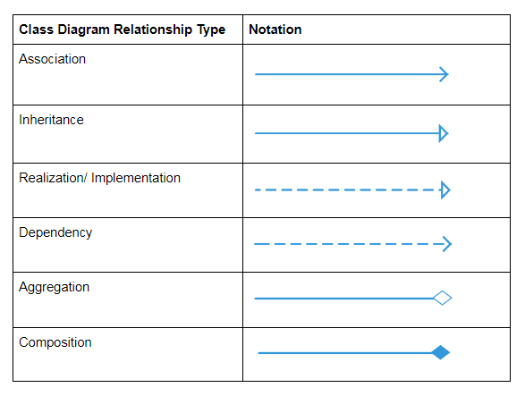
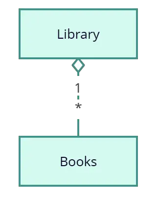

# Diagramme de Classes : Concepts, Relations et Attributs

Dans cette première partie du cours, nous allons explorer en profondeur les concepts fondamentaux du diagramme de classes, l'un des diagrammes les plus essentiels du langage de modélisation UML (Unified Modeling Language). Le diagramme de classes joue un rôle crucial dans la représentation visuelle de la structure statique d'un système logiciel, offrant une vue panoramique et organisée des composants et de leurs interrelations. Cette exploration approfondie nous permettra de saisir la puissance de cet outil dans la conception et la communication de la structure des systèmes logiciels complexes.

La nature statique du diagramme de classes lui permet de capturer l'essence des entités clés du système, en mettant en évidence les relations et les attributs qui définissent leur structure et leur comportement. Ce diagramme offre une abstraction visuelle qui transcende la complexité du code sous-jacent et permet aux concepteurs, aux développeurs et aux parties prenantes de saisir rapidement l'architecture et l'organisation d'un système.

Au cœur du diagramme de classes se trouvent les classes elles-mêmes, qui agissent comme les blocs de construction fondamentaux du système. Chaque classe représente un concept, un objet ou une entité du monde réel, encapsulant à la fois les données (sous la forme d'attributs) et les fonctionnalités (sous la forme de méthodes). En identifiant et en définissant ces classes, nous jetons les bases pour la compréhension et la modélisation des interactions et des comportements du système.

La richesse des relations entre ces classes est tout aussi cruciale. Les relations, comme les associations, les agrégations, les compositions et l'héritage, tissent un réseau de connexions significatives entre les entités du système. Les associations capturent les interactions et les liens entre les classes, tandis que les agrégations et les compositions expriment des relations tout-partie, décrivant comment les éléments s'assemblent pour former des structures complexes. L'héritage, quant à lui, favorise la réutilisation du code et la modélisation des hiérarchies entre les classes, permettant d'établir des relations de parenté et de descendant.

En plongeant dans ces types de relations, nous acquérons une perspective holistique sur la manière dont les classes interagissent et s'organisent au sein du système. Cette compréhension approfondie est la clé pour créer des architectures logicielles flexibles, extensibles et bien structurées.

Au cours de cette partie du cours, nous allons explorer chaque aspect de manière détaillée, en utilisant des exemples concrets pour illustrer ces concepts fondamentaux. Nous allons aborder non seulement la théorie, mais aussi la pratique en appliquant ces concepts à travers des exercices pratiques et des études de cas. Cette immersion complète dans les diagrammes de classes jettera les bases solides pour la suite de notre parcours, où nous explorerons d'autres types de diagrammes UML et leurs applications dans le développement logiciel.

## Classes, Attributs et Méthodes

### Classes : 
Une classe constitue l'une des pierres angulaires du diagramme de classes. Elle représente une entité conceptuelle, un objet ou un concept spécifique au sein du système modélisé. Les classes servent de moule à partir duquel des objets concrets seront créés et possèdent une structure commune pour définir les propriétés et les comportements associés. Dans le contexte d'un diagramme de classes, chaque classe encapsule des attributs (variables) qui déterminent ses caractéristiques distinctives, ainsi que des méthodes (fonctions) qui expriment les actions qu'une instance de cette classe peut effectuer. À titre d'illustration, si nous considérons un système de gestion de bibliothèque, une classe nommée "Livre" pourrait être créée pour représenter les attributs et les actions liés aux livres au sein de la bibliothèque.

La représentation visuelle de la classe est la suivante :

>Elle est représentée par un rectangle comportant jusqu’à 3 compartiments.
>
>Le premier montre le nom de la classe, tandis que le second montre les attributs de la classe qui sont les caractéristiques des objets. La partie inférieure énumère les opérations de la classe, ce qui représente le comportement de la classe.

source : https://creately.com/blog/fr/uncategorized-fr/tutoriel-sur-les-diagrammes-de-classe/

### Attributs :

Les attributs jouent un rôle essentiel dans la définition des caractéristiques intrinsèques d'une classe. Ils sont les éléments de données qui identifient et distinguent les instances de cette classe. Prenons l'exemple de la classe "Livre" dans un système de gestion de bibliothèque. Les attributs de cette classe pourraient inclure des informations telles que le "titre" du livre, le "nom de l'auteur", l'"année de publication" et le "numéro d'exemplaire". Chacun de ces attributs représente une propriété spécifique d'un livre et contribue à façonner son identité. En modélisant ces attributs dans le diagramme de classes, nous établissons la structure fondamentale des objets qui seront créés à partir de cette classe.

### Méthodes :

Les méthodes représentent les actions ou les comportements qu'une classe peut exécuter. Elles définissent les opérations et les interactions associées à une classe spécifique. Dans le contexte de la classe "Livre", les méthodes pourraient inclure des actions telles que "emprunter()" pour indiquer qu'un livre a été emprunté par un utilisateur, "retourner()" pour signaler le retour d'un livre, et "vérifierDisponibilité()" pour déterminer si un livre est actuellement disponible à l'emprunt. Les méthodes permettent aux instances de la classe d'interagir avec d'autres parties du système et d'accomplir des tâches spécifiques. En incorporant ces méthodes dans le diagramme de classes, nous façonnons le comportement et les interactions de chaque classe.

***En résumé, On se concentre ici sur les éléments fondamentaux du diagramme de classes : les classes, les attributs et les méthodes. Les classes servent de modèles conceptuels pour les objets du système, tandis que les attributs définissent leurs propriétés uniques et les méthodes spécifient leurs comportements. Comprendre ces concepts est essentiel pour construire une représentation visuelle précise et cohérente de la structure statique d'un système logiciel.***

## Associations, Agrégations, Compositions et Héritage

Pour représenter les associations, agrégations et compositions voici les formes visuelles du diagramme uml : 

source: https://creately.com/blog/fr/uncategorized-fr/tutoriel-sur-les-diagrammes-de-classe/

### Associations

Les associations sont les liens fondamentaux qui se tissent entre les classes dans un diagramme de classes. Elles reflètent les interactions et les connexions existant entre les objets représentés par ces classes. En d'autres termes, les associations décrivent les relations qui peuvent exister entre les instances de différentes classes. Prenons l'exemple d'un système de gestion de commande. Si nous établissons une association entre les classes "Commande" et "Client", cela signifie que chaque commande est liée à un client spécifique. Cette association nous permet de visualiser comment les commandes sont reliées aux clients qui les ont passées, créant ainsi un lien significatif entre les objets du système.

On distingue généralement trois types d'associations (les images suivantes et les textes sont tirés de l'article : https://creately.com/guides/class-diagram-relationships/ ): 

L'*association simple* qui se symbolise de la manière suivante : 

Il s'agit d'une connection logique sans lien de hiérarchie.

L'*association dirigée*

Fait référence à une relation directionnelle représentée par une ligne munie d'une flèche. La flèche représente un flux directionnel de contenant-contenu.

L'*association reflexive*

Cela se produit lorsque une classe peut avoir plusieurs fonctions ou responsabilités. Par exemple, un membre du personnel travaillant dans un aéroport peut être pilote, ingénieur en aviation, répartiteur de billets, agent de sécurité ou membre de l'équipe de maintenance. Si le membre de l'équipe de maintenance est supervisé par l'ingénieur en aviation, il pourrait y avoir une relation "supervisé par" dans deux instances de la même classe.

L'*association multiple*

Il s'agit de l'association logique active lorsque la cardinalité d'une classe par rapport à une autre est représentée. Par exemple, une flotte peut inclure plusieurs avions, tandis qu'un avion commercial peut contenir de zéro à de nombreux passagers. La notation 0..* sur le diagramme signifie "de zéro à plusieurs".

### Agrégations

Agrégations : L'agrégation est une relation qui exprime une connexion "tout-partie" entre les classes. En d'autres termes, une agrégation indique qu'une classe (la "partie") peut exister en dehors de la classe principale (le "tout"). Prenons l'exemple d'un diagramme de classes pour des véhicules. Si nous établissons une agrégation entre la classe "Véhicule" et la classe "Moteur", cela signifie que les moteurs peuvent être des entités indépendantes, même s'ils sont associés aux véhicules. Les moteurs existent en dehors des véhicules et peuvent être utilisés dans d'autres contextes.

Elle se représente visuellement de la façon suivante : 

Pour montrer l'agrégation dans un diagramme, tracez une ligne de la classe parent à la classe enfant avec une forme de losange près de la classe parent.

### Compositions

La composition partage des similitudes avec l'agrégation, mais avec une relation plus étroite. Dans une composition, les "parties" sont intrinsèquement liées à la classe principale. Autrement dit, les parties ne peuvent pas exister en dehors de la classe principale. En reprenant l'exemple d'un schéma de classes pour une "Maison" et ses "Chambres", une composition suggérerait que les chambres ne peuvent pas exister sans une maison. Une chambre ne peut exister en isolation ; elle fait partie intégrante de la maison et n'a de sens que dans ce contexte.

Elle se représente visuellement de la façon suivante :

Pour montrer une relation de composition dans un diagramme UML, utilisez une ligne directionnelle reliant les deux classes, avec une forme de losange rempli adjacent à la classe conteneur et la flèche directionnelle vers la classe contenue.

### Héritage

L'héritage est une relation fondamentale dans laquelle une classe (la "sous-classe" ou "classe dérivée") hérite des attributs et des méthodes d'une autre classe (la "super-classe" ou "classe de base"). Cette relation favorise la réutilisation du code et permet de modéliser des hiérarchies entre les classes. Par exemple, considérons une classe "Véhicule" en tant que super-classe et une classe "Voiture" en tant que sous-classe. La classe "Voiture" hérite des caractéristiques générales de la classe "Véhicule", telles que la vitesse maximale et le nombre de roues. L'héritage permet de capturer des similitudes et des généralités entre les classes tout en introduisant des spécificités propres à chaque sous-classe.

Elle se représente visuellement de la façon suivante :

Pour montrer l'héritage dans un diagramme UML, une ligne solide de la classe enfant vers la classe parent est dessinée en utilisant une tête de flèche non remplie.

### Realization (mise en oeuvre)

La notion de mise en œuvre dans le contexte d'un diagramme de classes UML fait référence à la façon dont une classe concrétise ou réalise la fonctionnalité définie dans une autre classe. Dans d'autres termes, une classe peut mettre en œuvre les méthodes et les comportements définis dans une autre classe, ce qui signifie qu'elle fournit une implémentation pratique pour ces fonctionnalités.

Lorsque l'on parle de mise en œuvre dans un diagramme de classes UML, cela fait généralement référence à l'implémentation d'interfaces ou de contrats définis dans une classe par une autre classe. Les interfaces sont des contrats abstraits qui spécifient les méthodes que les classes concrètes doivent implémenter. Dans ce contexte, une classe qui implémente une interface s'engage à fournir une implémentation concrète pour les méthodes déclarées dans cette interface.

Pour représenter cette relation de mise en œuvre dans un diagramme de classes UML, une ligne discontinue (en pointillés) est tracée entre les deux classes concernées. Cette ligne discontinue est accompagnée d'une flèche non remplie, pointant de la classe qui définit la fonctionnalité (souvent une interface) vers la classe qui met en œuvre cette fonctionnalité (classe concrète). Cela indique que la classe concrète fournit une implémentation concrète des méthodes définies dans l'interface.

Prenons un exemple pour illustrer cela : supposons que nous ayons une interface "InterfaceImpression" avec une méthode "configurerPreferencesImpression()". Une classe "Imprimante" pourrait mettre en œuvre cette interface, fournissant ainsi une implémentation concrète de la méthode "configurerPreferencesImpression()". Dans ce cas, une ligne en pointillés serait tracée de l'interface "InterfaceImpression" vers la classe "Imprimante", avec une flèche non remplie indiquant que la classe "Imprimante" met en œuvre les fonctionnalités définies dans l'interface.

Elle se représente visuellement de la façon suivante :

***En résumé on se penche ici sur les types de relations entre les classes : associations, agrégations, compositions, héritage; realization. Ces relations enrichissent le diagramme de classes en modélisant les interactions et les dépendances qui existent entre les entités du système. Les associations dépeignent les liens entre les objets, les agrégations et les compositions décrivent les relations "tout-partie", tandis que l'héritage permet de construire des hiérarchies et de promouvoir la réutilisation du code. Comprendre ces relations est essentiel pour saisir la structure et la dynamique sous-jacentes du système modélisé.***

### Exemples de diagramme de classe

Source : https://creately.com/blog/fr/uncategorized-fr/tutoriel-sur-les-diagrammes-de-classe/

### Pour aller plus loin

Guidelines pour les ULM Class Diagrams : 
https://creately.com/blog/diagrams/guidelines-for-uml-class-diagrams-part-1/
https://creately.com/blog/diagrams/guidelines-for-uml-class-diagrams-part-2/

## TP: Modélisation d'un Système de Gestion de Bibliothèque avec les Diagrammes de Classes

**Description :**
Dans ce TP, vous allez utiliser le plugin UMLet dans Visual Studio Code pour modéliser un système de gestion de bibliothèque. Vous devrez identifier les classes, les attributs, les méthodes et les relations appropriées pour représenter les entités et les interactions dans ce système.

### Tâche : Modélisation d'un Système de Gestion de Bibliothèque

Imaginez un système de gestion de bibliothèque où les utilisateurs peuvent emprunter et retourner des livres. Les livres ont des attributs tels que le titre, l'auteur et l'année de publication. Les utilisateurs sont identifiés par leur nom, leur numéro de membre et leur historique d'emprunts.

1. **Identifiez les Classes :** Utilisez le plugin UMLet dans Visual Studio Code pour identifier les classes nécessaires pour modéliser ce système. Pensez aux entités clés impliquées dans la gestion de bibliothèque.

2. **Définissez les Attributs :** Utilisez UMLet pour définir les attributs appropriés pour chaque classe identifiée. Quels sont les attributs nécessaires pour capturer les informations importantes liées à chaque classe ?

3. **Spécifiez les Méthodes :** Utilisez UMLet pour spécifier les méthodes nécessaires pour chaque classe. Pensez aux actions que chaque classe doit pouvoir effectuer, comme emprunter un livre ou afficher l'historique des emprunts.

4. **Établissez les Relations :** Utilisez UMLet pour identifier et spécifier les relations entre les classes. Les utilisateurs empruntent des livres, ce qui crée une relation. Pensez également à la relation entre les livres et leur catégorie, par exemple.

5. **Créez le Diagramme de Classes :** Utilisez UMLet dans Visual Studio Code pour créer le diagramme de classes. Ajoutez les classes, les attributs, les méthodes et les relations en conséquence.

6. **Annoter le Diagramme :** Utilisez UMLet pour ajouter des descriptions aux classes, aux attributs et aux méthodes pour expliquer leur fonction.

7. **Exercice Pratique :** Proposez un scénario où un utilisateur emprunte un livre, puis le retourne. Utilisez le diagramme de classes pour illustrer comment ces actions sont réalisées.

### Rapport

Rédigez un court rapport (environ une page) décrivant les choix que vous avez faits lors de la modélisation à l'aide d'UMLet dans Visual Studio Code, en expliquant comment chaque classe, attribut, méthode et relation reflète le fonctionnement du système de gestion de bibliothèque. Incluez également une capture d'écran du diagramme de classes créé avec UMLet.

**Consignes :**
- Travaillez en groupes de 2 ou 3 personnes.
- Utilisez le plugin UMLet dans Visual Studio Code pour créer le diagramme de classes.
- Soyez clairs et précis dans vos annotations et descriptions.