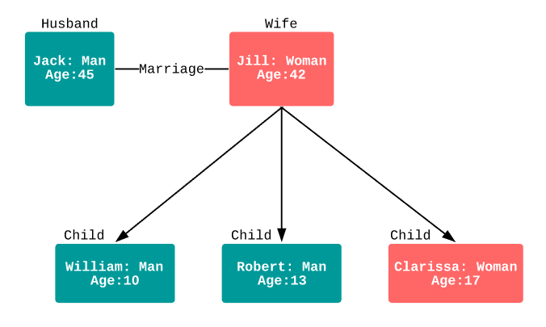

# Chapitre 4 Diagramme d'objets

## Diagramme d'Objets : représentation des instances de classes

Le diagramme d'objets en UML (Unified Modeling Language) est un type de diagramme qui représente les instances spécifiques des classes et leurs relations dans un système logiciel. Contrairement au diagramme de classes qui se concentre sur la structure des classes et de leurs attributs, le diagramme d'objets met l'accent sur les objets réels créés à partir de ces classes lors de l'exécution d'un programme. Il permet de visualiser concrètement comment les objets interagissent et se connectent les uns aux autres au sein d'un système.

Le diagramme d'objets est utile pour comprendre et modéliser les interactions dynamiques entre les objets lors de l'exécution d'un scénario particulier. Il permet aux concepteurs et aux développeurs de mieux saisir comment les objets interagissent, quels attributs spécifiques possèdent les instances et comment les instances sont liées par des relations.

## Concepts et notion d'instanciation

Voici les principaux éléments et concepts du diagramme d'objets :

1. **Objet :** Un objet est une instance spécifique d'une classe. Il possède des attributs spécifiques avec des valeurs concrètes et peut exécuter les méthodes définies dans sa classe parente.

2. **Classe :** Les classes sont les modèles abstraits à partir desquels les objets sont créés. Les classes définissent les attributs et les méthodes communes à toutes leurs instances.

3. **Attributs :** Les attributs d'une classe sont les propriétés spécifiques que possèdent les objets créés à partir de cette classe. Dans un diagramme d'objets, les attributs sont représentés avec leurs valeurs spécifiques pour chaque objet.

4. **Relations :** Les relations entre objets sont illustrées par des liens et des connexions. Ces relations peuvent être des associations, des dépendances, des héritages, des agrégations, des compositions, etc.

5. **Instantiation :** L'instantiation est le processus de création d'objets à partir des modèles de classes. Chaque objet créé est une instance unique de sa classe parente.

6. **Relations d'Association :** Les relations d'association décrivent comment les objets de différentes classes interagissent. Elles montrent comment un objet d'une classe est lié à un ou plusieurs objets d'autres classes.

7. **Relations de Dépendance :** Les relations de dépendance indiquent qu'un objet dépend d'un autre objet pour réaliser une certaine opération.

8. **Relations d'Héritage :** Les relations d'héritage montrent comment les sous-classes héritent des attributs et des méthodes de leurs super-classes.

9. **Multiplicité :** La multiplicité indique combien d'objets participent à une relation. Elle peut être exprimée sous forme de nombres ou de plages.

10. **Rôles :** Les rôles sont des noms donnés aux extrémités des associations pour décrire la nature de la relation entre les objets.

Le diagramme d'objets est particulièrement utile pour modéliser les interactions et les scénarios spécifiques dans un système logiciel, en montrant comment les instances de classes collaborent et échangent des informations. C'est un outil essentiel pour comprendre la dynamique d'un système et pour effectuer des tests et des vérifications approfondis sur les interactions entre les objets.

## Relations dans un diagramme d'objets

## Relations d'association
Les relations d'association constituent l'un des aspects fondamentaux de la modélisation des interactions entre les objets dans un diagramme d'objets. Elles permettent de représenter les liens et les connexions entre les instances d'une ou plusieurs classes. Ces relations sont particulièrement utiles pour décrire des scénarios où les objets coopèrent, partagent des informations ou participent à des interactions spécifiques. Voici une explication plus approfondie de ces relations et de leur importance :

#### Capture des Liens entre Objets

Les relations d'association sont utilisées pour capturer les relations sémantiques entre les objets de différentes classes. Ces relations illustrent la manière dont les objets interagissent, collaborent ou communiquent dans le contexte d'un système. Par exemple, prenons les instances d'une classe "Étudiant" et d'une classe "Cours". En modélisant une relation d'association entre ces deux classes, nous pouvons décrire le lien entre un étudiant et un cours particulier auquel il est inscrit. Cette relation d'association permet de formaliser visuellement le fait qu'un étudiant participe à un cours spécifique.

#### Scénarios de Coopération et d'Échange

Les relations d'association sont souvent utilisées pour modéliser des scénarios où les objets coopèrent, échangent des informations ou participent à des activités communes. Dans l'exemple précédent, la relation d'association entre "Étudiant" et "Cours" reflète le scénario d'inscription à un cours. Cette relation peut également être étendue pour représenter d'autres scénarios de collaboration, tels que l'attribution de notes aux étudiants, l'organisation de discussions en ligne, etc. En utilisant les relations d'association, nous pouvons décomposer des interactions complexes en éléments plus simples et compréhensibles.

#### Connexions et Collaborations
Les relations d'association permettent de définir comment les objets sont connectés les uns aux autres et comment ils collaborent pour atteindre des objectifs communs. Elles offrent une vue d'ensemble des interactions entre les instances d'une classe et les instances d'autres classes. Par exemple, dans le contexte de l'inscription à un cours, la relation d'association peut impliquer que l'objet "Étudiant" communique avec l'objet "Cours" pour s'inscrire. Cette représentation visuelle des collaborations entre objets facilite la communication et la compréhension des mécanismes sous-jacents du système.

>En résumé, les relations d'association sont un élément essentiel pour modéliser les interactions entre les objets dans un diagramme d'objets. Elles permettent de capturer les liens, les collaborations et les échanges entre les instances de différentes classes, ce qui contribue à une représentation précise et compréhensible de la dynamique du système.

Rappel les représentations visuelles de ces différentes relations sont disponibles au chapitre 3

### Relations de dépendance

Les relations de dépendance sont une notion cruciale pour représenter les interactions transitoires et les dépendances fonctionnelles entre les objets d'un système dans un diagramme d'objets. Ces relations mettent en évidence le fait qu'une instance d'une classe peut dépendre d'une autre instance d'une classe différente pour accomplir une tâche spécifique. Les relations de dépendance sont particulièrement utiles pour modéliser des scénarios où les objets nécessitent ponctuellement l'aide ou les informations d'autres objets pour accomplir leurs fonctions. Voici une explication approfondie de ces relations et de leur rôle dans la modélisation :

#### Interactions Transitoires 

Les relations de dépendance capturent des interactions temporaires entre les objets. Contrairement aux relations d'association qui se concentrent sur les liens plus stables et durables entre les objets, les relations de dépendance reflètent des besoins ponctuels. Ces besoins peuvent être liés à l'obtention d'informations, l'exécution d'une opération particulière ou l'accès à des ressources spécifiques. Par exemple, dans un système de commande en ligne, une classe "Commande" peut dépendre d'une classe "Client" pour obtenir les détails du client passant la commande. Cette dépendance transitoire met en évidence que la création d'une commande nécessite des informations contextuelles provenant d'une instance de la classe "Client".

#### Besoin d'Informations et de Fonctionnalités

Les relations de dépendance sont particulièrement pertinentes lorsque les objets ont besoin d'informations, de services ou de fonctionnalités spécifiques d'autres objets pour accomplir leurs tâches. Par exemple, dans un système de réservation de vols, une instance de la classe "Billet" pourrait dépendre d'une instance de la classe "Vol" pour obtenir des informations sur le vol correspondant au billet. Cette dépendance temporaire entre les objets aide à modéliser la nécessité d'accéder à des données provenant d'autres parties du système.

#### Scénarios de Collaboration Temporaire

Les relations de dépendance permettent de représenter des scénarios de collaboration temporaire où les objets interagissent pour un besoin spécifique. Ces interactions ponctuelles sont importantes pour saisir les dépendances fonctionnelles et les interactions transitoires dans le système. Dans l'exemple de la commande en ligne, la relation de dépendance entre "Commande" et "Client" illustre la nécessité pour la classe "Commande" d'obtenir des informations du client au moment de la création de la commande.

> En résumé, les relations de dépendance sont utilisées pour modéliser les interactions transitoires et les dépendances fonctionnelles entre les objets dans un diagramme d'objets. Elles représentent les scénarios où une instance d'une classe a besoin de l'aide ou des informations d'une instance d'une autre classe pour accomplir une tâche spécifique. Ces relations sont essentielles pour capturer les interactions ponctuelles et les besoins temporaires au sein du système.

Rappel les représentations visuelles de ces différentes relations sont disponibles au chapitre 3

### Relations d'Héritage

Les relations d'héritage sont un concept central dans la modélisation orientée objet et sont utilisées pour représenter la structure hiérarchique des classes au sein d'un diagramme d'objets. L'héritage permet à une classe de dériver des attributs et des méthodes d'une autre classe, créant ainsi une relation de spécialisation et de généralisation. Cette relation d'héritage capture l'idée que certaines classes partagent des propriétés communes tout en étendant ou en spécialisant ces propriétés pour répondre à des besoins spécifiques. Voici une explication détaillée des relations d'héritage et de leur rôle dans la modélisation :

#### Hiérarchie des Classes :

Les relations d'héritage sont utilisées pour représenter la structure hiérarchique des classes dans un système. Cette hiérarchie est basée sur le concept de généralisation et de spécialisation, où une classe de base (super-classe) peut avoir des sous-classes (sous-classes) qui héritent de ses caractéristiques. Par exemple, dans un système de gestion d'une université, une super-classe "Personne" pourrait avoir des sous-classes telles que "Étudiant" et "Enseignant", chacune héritant des attributs et des méthodes généraux de "Personne".

#### Héritage de Caractéristiques :

Lorsqu'une instance d'une sous-classe hérite de la super-classe, cela signifie que l'objet de la sous-classe possède non seulement les attributs spécifiques à cette sous-classe, mais aussi ceux hérités de la super-classe. Prenons l'exemple d'une sous-classe "Enseignant" qui hérite de la super-classe "Personne". Une instance d' "Enseignant" aurait les attributs de base tels que le nom et l'âge hérités de "Personne", en plus des attributs spécifiques aux enseignants tels que le domaine d'enseignement et le nombre d'années d'expérience.

#### Réutilisation du Code :

L'héritage favorise la réutilisation du code en permettant aux sous-classes de hériter des fonctionnalités de la super-classe. Cela évite la duplication de code et permet de centraliser les fonctionnalités communes dans une super-classe, ce qui simplifie la maintenance et la gestion du code. Par exemple, si plusieurs classes partagent des attributs ou des méthodes similaires, ces éléments peuvent être définis une seule fois dans la super-classe et hérités par les sous-classes.

#### Modélisation des Généralisations et des Spécialisations :

Les relations d'héritage sont utilisées pour modéliser les concepts de généralisation (création d'une super-classe pour des caractéristiques communes) et de spécialisation (création de sous-classes pour des caractéristiques spécifiques). Par exemple, si une super-classe "Véhicule" a des sous-classes "Voiture" et "Moto", cela permet de modéliser la relation générale entre les véhicules et les caractéristiques spécifiques des voitures et des motos.

#### Simplification de la Modélisation 

L'héritage simplifie la modélisation en évitant la redondance et en organisant les classes de manière logique. Plutôt que de définir séparément chaque attribut et méthode pour chaque sous-classe, vous pouvez les définir une seule fois dans la super-classe. Cela rend le diagramme d'objets plus clair et plus efficace.

> En somme, les relations d'héritage sont utilisées pour représenter la structure hiérarchique des classes et pour modéliser la généralisation et la spécialisation des concepts. Elles favorisent la réutilisation du code, la simplification de la modélisation et permettent de capturer les similitudes et les différences entre les classes.

Rappel les représentations visuelles de ces différentes relations sont disponibles au chapitre 3

## Exemples de diagrammes d'objets

source : https://www.lucidchart.com/pages/fr/diagramme-dobjets-uml

source : https://www.lucidchart.com/pages/fr/diagramme-dobjets-uml