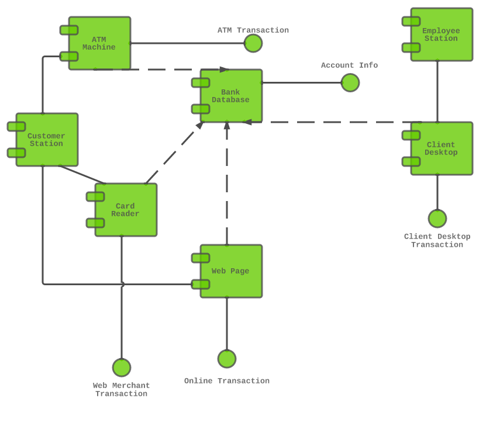

# Chapitre 5 : Diagramme de composants

## Diagramme de Composants : Visualisation des Composants d'un Système

Le diagramme de composants est un outil puissant dans le langage de modélisation UML (Unified Modeling Language) qui permet de visualiser la structure et l'organisation des composants d'un système logiciel. Ce diagramme met l'accent sur la modularité et la composition du système en représentant les composants clés, leurs interactions, ainsi que les dépendances et les interfaces qui les relient. Dans cette section, nous allons explorer en détail le diagramme de composants et ses éléments constitutifs.

## Composants, Interfaces et Dépendances

Dans l'univers du diagramme de composants, les concepts de composants, d'interfaces et de dépendances s'entrelacent harmonieusement pour façonner la structure et l'orchestration d'un système logiciel. Ensemble, ils dépeignent les fondations essentielles qui permettent la construction et l'évolution de systèmes complexes tout en facilitant leur maintien et leur réutilisabilité.

### Composant : La Brique Fonctionnelle

Un composant, tel un bloc de construction dans un édifice, représente une unité fonctionnelle modulaire du système. Il est souvent comparé à une boîte noire, possédant une fonction spécifique, tout en cachant les détails de son fonctionnement interne. Cela pourrait prendre la forme d'une bibliothèque de fonctions, d'un module encapsulant des fonctionnalités spécifiques ou même d'un service qui offre des capacités bien définies. La clé réside dans la conception de ces composants pour qu'ils soient autonomes et réutilisables, simplifiant ainsi la complexité et permettant une maintenance aisée.

### Interfaces : Le Contrat de Collaboration

Chaque composant n'est pas une île isolée, mais une entité qui collabore avec d'autres. C'est ici que les interfaces entrent en jeu. Une interface est un contrat qui définit les méthodes, les services ou les fonctionnalités qu'un composant expose aux autres. Elle spécifie comment les autres composants peuvent interagir avec le composant en question. Comme une conversation entre des composants, les interfaces clarifient comment la collaboration doit se dérouler et quels échanges sont permis.

### Dépendances : L'Échange de Services

Les dépendances entre composants reflètent les relations d'échange de services entre les différents composants. Un composant peut dépendre des services offerts par un autre pour accomplir une tâche spécifique. Ces dépendances montrent comment les composants s'entraident pour réaliser des fonctionnalités plus complexes. Par exemple, un composant de gestion de paiement peut dépendre d'un composant de gestion d'utilisateurs pour récupérer des informations sur un utilisateur effectuant un paiement. Ces dépendances créent un réseau de support mutuel entre les composants, chaque maillon jouant un rôle essentiel dans la chaîne de fonctionnalités.

### Un Exemple Concret : Les Composants dans un Système de Commerce Électronique

Prenons l'exemple d'un système de commerce électronique. Un composant "Panier d'Achat" pourrait dépendre d'un composant "Catalogue de Produits" pour obtenir les informations nécessaires sur les produits à afficher dans le panier. Ici, la dépendance entre ces deux composants montre comment ils collaborent pour offrir une expérience d'achat complète. La dépendance est symbolisée par une flèche pointant du composant dépendant (Panier d'Achat) vers le composant sur lequel il dépend (Catalogue de Produits).

## Aspects de Déploiement

Le diagramme de composants, loin d'être confiné à la sphère abstraite de la structure interne, s'étend également à l'horizon tangible du déploiement sur des nœuds matériels. Cette extension permet de passer du conceptuel au concret en illustrant comment les composants, ces unités fonctionnelles, prennent vie sur l'infrastructure matérielle.

### Les Nœuds Matériels : Bases Physiques

Dans cette perspective, les nœuds matériels deviennent des points d'ancrage pour les composants. Ils représentent les fondations physiques sur lesquelles l'architecture logicielle prend forme. Un nœud peut être une machine physique, un serveur, une machine virtuelle, un appareil ou tout autre environnement d'exécution. Chaque nœud possède ses caractéristiques propres, telles que la puissance de calcul, la capacité de stockage et la bande passante, qui influencent le comportement et les performances des composants qui y sont déployés.

### Déploiement de Composants : L'Atelier Concret

En utilisant le diagramme de composants pour illustrer le déploiement, chaque composant devient une entité qui a une "maison" sur un nœud matériel spécifique. Cela signifie que les interactions entre les composants ne sont pas seulement conceptualisées, mais également situées dans un contexte physique. Par exemple, si un composant "Base de Données" est déployé sur un serveur spécifique, cela implique que les autres composants qui interagissent avec la base de données se connectent à ce serveur.

### Utilité et Planification : Une Perspective Pragmatique

Cette visualisation du déploiement a une utilité pratique considérable. Elle permet aux architectes et aux ingénieurs de planifier et d'optimiser l'infrastructure matérielle nécessaire pour exécuter le système logiciel. Cela peut aider à éviter les goulets d'étranglement, à répartir équitablement la charge de travail et à garantir des performances optimales. De plus, cela facilite la communication entre les équipes de développement et d'opérations, car elles peuvent maintenant parler du déploiement du logiciel dans un langage compréhensible par tous.

### Un Exemple : Déploiement d'une Application Web

Imaginons le déploiement d'une application web. Les composants tels que "Serveur Web", "Base de Données" et "Service de Messagerie" sont associés à des nœuds matériels distincts, représentant des serveurs physiques ou des machines virtuelles. Cette visualisation pourrait montrer comment l'application est répartie entre différents serveurs pour garantir des performances et une disponibilité optimales.

## Les représentations visuelles d'un diagramme de composant

Les images et texte sont empruntés à https://www.lucidchart.com/pages/fr/diagramme-de-composants-uml

### Symbole de composant 

 

Entité tenue d'exécuter une fonction stéréotypée. Un composant fournit et consomme un comportement par le biais d'interfaces, ainsi que par le biais d'autres composants. Considérez les composants comme un type de classe. En UML 1.0, un composant est modélisé sous forme de bloc rectangulaire avec deux rectangles plus petits qui dépassent sur le côté. En UML 2.0, un composant est modélisé sous forme de bloc rectangulaire avec une petite image de l'ancienne forme UML 1.0.

Il existe trois manières courantes de créer un compartiment pour le nom d'un composant. Vous devez toujours inclure le texte du composant entre des chevrons et/ou le logo du composant. La distinction est importante, car un rectangle indiquant uniquement un nom à l'intérieur est réservé aux classificateurs (éléments de classe).

Comme pour la notation de classe, les composants disposent également d'un espace facultatif pour énumérer les interfaces, de la même manière que vous ajoutez des attributs et des méthodes à la notation de classe. Les interfaces représentent les endroits où les groupes de classes du composant communiquent avec les autres composants du système. Une autre façon de représenter les interfaces consiste à étendre les symboles au-delà de la boîte du composant.

### Symbole d'interface 

Indique les entrées ou les données qu'un composant reçoit ou fournit. Les interfaces peuvent être représentées par des notes textuelles ou des symboles, tels que des formes de sucette, de douille ouverte et d'articulation.

Interfaces fournies : une ligne droite s'étend à partir de la boîte du composant avec un cercle à l'extrémité. Ces symboles représentent les interfaces où un composant produit des informations utilisées par l'interface requise d'un autre composant.
Diagramme de composants UML Interfaces requises

Interfaces requises : une ligne droite s'étend à partir de la boîte du composant avec un demi-cercle à son extrémité (parfois également représenté par une ligne en pointillé avec une flèche ouverte). Ces symboles représentent les interfaces où un composant a besoin d'informations pour remplir sa fonction.

### Symbole de noeud 

Représente des objets matériels ou logiciels situés à un niveau supérieur aux composants.

### Symbole de port

Spécifie un point d'interaction distinct entre un composant et son environnement. Les ports sont symbolisés par un petit carré.

### Symbole de dépendance

Indique les relations de dépendance entre les différentes parties de votre système. Les dépendances sont représentées par des lignes pointillées reliant un composant (ou élément) à un autre.

## Exemples de diagrammes de composants : 

source : https://www.lucidchart.com/pages/fr/diagramme-de-composants-uml

## Titre du TP : Modélisation d'un Système de Réservation de Vols en Utilisant les Diagrammes d'Objets et de Composants

Objectif : Créer des diagrammes d'objets et de composants pour un système de réservation de vols en ligne.

Durée : 2 heures

Instructions :

### Étape 1 : Modélisation des Objets

Analyse des Exigences : Imaginez un système de réservation de vols en ligne. Le système permet aux utilisateurs de rechercher des vols, de réserver des billets et de gérer leurs réservations.

Identifiez les objets clés du système, tels que "Utilisateur", "Vol", "Billet", "Réservation", etc.

Pour chaque objet identifié, créez une liste d'attributs pertinents. Par exemple, l'objet "Vol" pourrait avoir des attributs tels que "Numéro de Vol", "Destination", "Heure de Départ", etc.

### Étape 2 : Création du Diagramme d'Objets

Ouvrez l'outil de modélisation UMLet sur visualstudio.

Créez un nouveau diagramme d'objets.

Placez les objets identifiés sur le diagramme en utilisant les icônes appropriées.

Pour chaque objet, ajoutez les attributs que vous avez identifiés, en utilisant une notation appropriée.

### Étape 3 : Modélisation des Composants

Identifiez les composants principaux du système, tels que "Gestionnaire de Réservations", "Système de Paiement", "Base de Données", etc.

Créez une liste des interfaces ou services offerts par chaque composant. Par exemple, le composant "Gestionnaire de Réservations" pourrait offrir des interfaces telles que "RechercherVol()", "RéserverBillet()", etc.

Identifiez les dépendances entre les composants. Par exemple, le composant "Système de Paiement" peut dépendre du composant "Gestionnaire de Réservations" pour obtenir les détails de la réservation.

### Étape 4 : Création du Diagramme de Composants

Créez un nouveau diagramme de composants dans l'outil de modélisation.

Placez les composants identifiés sur le diagramme en utilisant les icônes appropriées.

Reliez les composants aux interfaces qu'ils offrent en utilisant des connecteurs.

Ajoutez des dépendances entre les composants pour représenter les relations de nécessité.

### Étape 5 : Documentation et Explication

Ajoutez des descriptions brèves pour chaque objet et composant pour expliquer leur rôle et leur fonctionnalité.

Utilisez des commentaires ou des notes pour clarifier des parties du diagramme qui nécessitent des explications supplémentaires.

### Étape 6 : Révision et Validation

Passez en revue vos diagrammes d'objets et de composants pour vous assurer qu'ils reflètent correctement la structure et les relations du système.

Assurez-vous que les noms des objets, des attributs et des composants sont appropriés et compréhensibles.

### Étape 7 : Présentation et Discussion

Présentez vos diagrammes d'objets et de composants aux autres étudiants, en expliquant les choix que vous avez faits pour les objets, les composants, les interfaces, les dépendances, etc.

