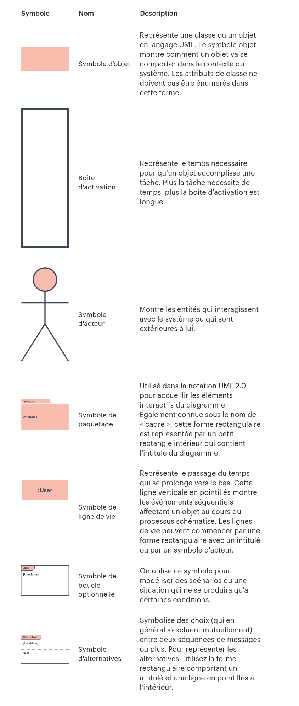
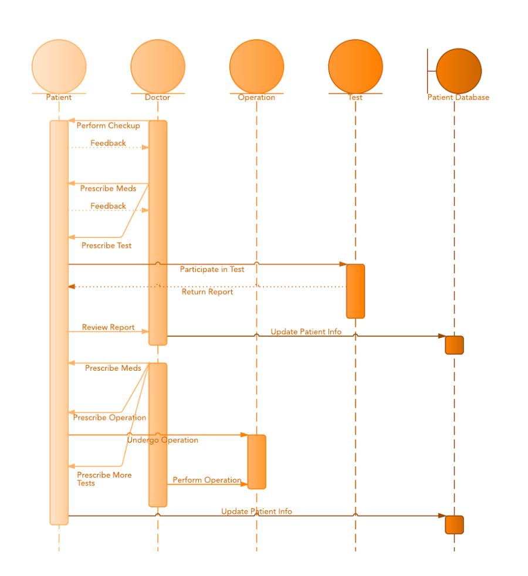
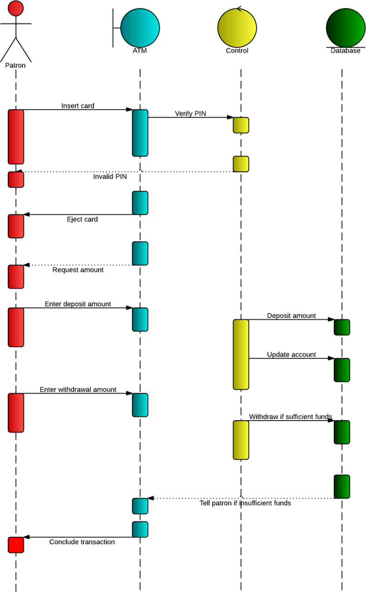

# Diagramme de Séquence

Dans cette section du cours, nous allons explorer en profondeur le diagramme de séquence, l'un des diagrammes les plus puissants du langage de modélisation UML (Unified Modeling Language). Le diagramme de séquence est utilisé pour représenter visuellement les interactions entre les acteurs, les objets et les composants d'un système, en mettant l'accent sur la chronologie des échanges d'informations. Nous allons plonger dans les concepts clés de ce diagramme et comprendre comment il permet de capturer le déroulement des scénarios d'interaction.

## Acteurs, objets et messages

### Acteurs

Les acteurs sont les entités externes qui interagissent avec le système que vous modélisez. Ils peuvent être des utilisateurs finaux, d'autres systèmes, des composants ou même des entités externes avec lesquelles votre système communique. Les acteurs interagissent avec le système en envoyant des messages et en recevant des réponses. Dans un diagramme de séquence, les acteurs sont généralement représentés par des lignes de vie horizontales qui sont situées en dehors de la boîte de séquence, pour indiquer qu'ils se trouvent en dehors du système modélisé. Par exemple, dans un système de réservation de vols, les acteurs pourraient être les "Utilisateurs" et les "Systèmes de Paiement".

### Objets

Les objets représentent les entités internes au système qui participent également aux interactions. Ils sont des instances de classes du système et peuvent représenter des composants, des modules, des entités métier, etc. Les objets sont responsables de la réalisation des actions spécifiées par les messages qu'ils reçoivent. Dans un diagramme de séquence, les objets sont représentés par des lignes de vie verticales qui sont situées à l'intérieur de la boîte de séquence. Par exemple, dans le contexte d'un système de réservation de vols, les objets pourraient être des instances de "Réservation", "Vol" et "Client".

### Messages

Les messages sont les moyens par lesquels les acteurs et les objets communiquent entre eux. Un message représente une demande d'action ou d'information. Il peut être envoyé d'un acteur ou d'un objet à un autre acteur ou objet. Les messages déclenchent des actions et des réponses, et ils suivent une séquence chronologique pour représenter le flux d'interaction. Les messages peuvent être de deux types principaux :

#### Message Synchrone 

Un message synchrone bloque l'émetteur jusqu'à ce que le récepteur ait reçu le message, traité l'action correspondante et envoyé une réponse. Ce type de message est représenté par une flèche pleine.

#### Message Asynchrone 

Un message asynchrone permet à l'émetteur de continuer son exécution sans attendre de réponse immédiate. Ce type de message est représenté par une flèche pointillée.

Chaque message est associé à un nom qui décrit l'action ou l'information qu'il transmet. Il peut également inclure des paramètres et des valeurs de retour pour détailler les informations transmises.

## Séquences d'Interaction

Les séquences d'interaction constituent la partie essentielle d'un diagramme de séquence en UML. Elles sont utilisées pour représenter en détail comment les acteurs et les objets interagissent les uns avec les autres dans un scénario spécifique. Les séquences d'interaction permettent de capturer l'ordre chronologique des échanges de messages entre les participants et de visualiser le flux d'exécution d'un processus.

### Lignes de Vie (Lifelines)

Chaque participant (acteur ou objet) impliqué dans une séquence d'interaction est représenté par une ligne de vie. Les lignes de vie sont des éléments verticaux qui s'étendent le long de l'axe vertical du diagramme de séquence. Chaque ligne de vie est étiquetée avec le nom du participant. Elles délimitent la durée de vie du participant pendant le scénario d'interaction.

### Messages

Les messages sont les moyens par lesquels les participants interagissent dans une séquence d'interaction. Les messages sont symbolisés par des flèches horizontales qui relient les lignes de vie des participants. Chaque flèche de message indique la direction de l'interaction, c'est-à-dire de l'émetteur vers le récepteur. Les messages sont accompagnés d'une étiquette qui décrit le contenu du message ou l'action qu'il représente.

### Flux Chronologique

La disposition verticale des lignes de vie sur le diagramme de séquence reflète le flux chronologique des interactions. En lisant le diagramme de haut en bas, on peut suivre l'ordre dans lequel les participants interagissent. Lorsqu'un participant envoie un message à un autre participant, cela est représenté par une flèche horizontale qui part de la ligne de vie de l'émetteur et aboutit à la ligne de vie du récepteur.

### Durée de Vie des Participants

La durée de vie d'un participant dans une séquence d'interaction est délimitée par la longueur de sa ligne de vie. Un participant est actif et impliqué dans l'interaction pendant toute la durée de sa ligne de vie. Si un participant n'est pas actif à un moment donné, sa ligne de vie ne sera pas visible pendant cette période.

### Fragments

Les fragments sont des éléments clés dans un diagramme de séquence qui permettent de représenter des parties conditionnelles, optionnelles ou répétitives d'une séquence d'interaction. Ils sont utilisés pour modéliser des scénarios plus complexes et pour montrer comment le flux d'exécution peut varier en fonction de certaines conditions. Les fragments ajoutent de la souplesse aux diagrammes de séquence, ce qui permet de capturer différentes voies de déroulement d'un scénario.

#### Fragments "alt" (Alternative)

Les fragments "alt" (alternative) modélisent différentes options d'exécution en fonction de conditions. Ils permettent de représenter des choix conditionnels dans une séquence d'interaction. Chaque branche du fragment "alt" correspond à une option possible, et seule l'une de ces branches sera exécutée, en fonction de la condition qui est vraie.

#### Fragments "opt" (Option)

Les fragments "opt" (option) modélisent des parties optionnelles d'une séquence d'interaction. Ils indiquent qu'une séquence d'interaction peut ou non être exécutée, en fonction de la condition qui est vraie. Si la condition est satisfaite, la séquence optionnelle sera exécutée. Sinon, elle sera simplement ignorée.

#### Fragments "loop" (Boucle)

Les fragments "loop" (boucle) modélisent une séquence d'interaction répétée plusieurs fois tant qu'une condition est vraie. Ils permettent de modéliser des boucles dans le scénario d'interaction. La séquence contenue dans le fragment "loop" sera répétée jusqu'à ce que la condition spécifiée ne soit plus satisfaite.

#### Fragments "par" (Parallèle)

Les fragments "par" (parallèle) modélisent des séquences d'interaction qui peuvent se produire simultanément. Ils représentent des interactions parallèles qui ne dépendent pas les unes des autres et qui peuvent être exécutées en même temps. Les fragments "par" sont utiles pour montrer comment différentes parties du système peuvent travailler de manière indépendante.

#### Combinaison de Fragments

Il est également possible de combiner plusieurs fragments pour modéliser des scénarios encore plus complexes. Par exemple, on peut avoir une branche "alt" à l'intérieur d'une boucle "loop" pour modéliser différentes options à chaque itération.

## Paquetages

Les paquetages, également connus sous le nom d'espaces de noms, sont des éléments utilisés pour organiser et structurer les éléments dans un modèle UML, y compris dans les diagrammes de séquence. Ils permettent de regrouper des éléments similaires ou connexes, ce qui améliore la lisibilité, la maintenance et la gestion du modèle. Dans les diagrammes de séquence, les paquetages peuvent être utilisés pour organiser les acteurs, les objets, les fragments et les autres éléments impliqués dans les interactions.

Voici comment les paquetages peuvent être utilisés dans les diagrammes de séquence :

### Organisation et Structuration

Les paquetages peuvent être utilisés pour regrouper des éléments liés dans un même espace logique. Par exemple, vous pouvez créer un paquetage pour regrouper tous les acteurs impliqués dans un scénario d'interaction spécifique. Cela rend le diagramme plus lisible en réduisant le désordre et en organisant les éléments de manière hiérarchique.

### Réutilisation 

Les paquetages facilitent la réutilisation des éléments. Vous pouvez regrouper des acteurs, des objets et des fragments spécifiques dans des paquetages et les utiliser dans plusieurs diagrammes de séquence. Cela permet d'éviter la redondance et de maintenir une cohérence entre les différents diagrammes.

### Gestion de la Complexité 

Les diagrammes de séquence peuvent devenir rapidement complexes, surtout pour des systèmes importants. Les paquetages offrent une manière de gérer cette complexité en divisant le modèle en parties plus petites et plus gérables. Cela facilite la navigation et la compréhension du modèle, en particulier pour les projets de grande envergure.

### Dépendances 

Les paquetages permettent également de gérer les dépendances entre les éléments. Si des éléments d'un paquetage dépendent d'éléments d'un autre paquetage, ces dépendances peuvent être gérées plus efficacement. Par exemple, si un fragment dépend d'un objet spécifique, vous pouvez organiser ces deux éléments dans des paquetages distincts.

Pour utiliser les paquetages dans un diagramme de séquence, vous pouvez simplement créer des boîtes rectangulaires autour des éléments que vous souhaitez regrouper. Vous pouvez nommer chaque paquetage de manière significative pour indiquer son contenu. Les dépendances entre les paquetages peuvent être représentées par des flèches.

## Représentation visuelle des éléments

## Exemples de diagrammes de séquences

Source : https://www.lucidchart.com/pages/fr/diagramme-de-sequence-uml

## Titre du TP : Modélisation d'un Système de Réservation de Vols en Utilisant les Diagrammes de Séquences

Objectif : Créer des diagrammes de séquences pour un système de réservation de vols en ligne en utilisant le plugin UMLet pour Visual Studio.

Durée : 2 heures

Instructions :

### Étape 1 : Modélisation des Scénarios d'Interaction

Analyse des Exigences : Imaginez un système de réservation de vols en ligne. Le système permet aux utilisateurs de rechercher des vols, de réserver des billets et de gérer leurs réservations.

Identifiez les scénarios d'interaction clés, tels que "Rechercher un Vol", "Réserver un Billet", "Gérer une Réservation", etc.

### Étape 2 : Création des Diagrammes de Séquences

Ouvrez Visual Studio avec le plugin UMLet installé.

Créez un projet pour le système de réservation de vols.

Dans le projet, créez un diagramme de séquence pour chaque scénario d'interaction identifié.

Identifiez les acteurs et les objets impliqués dans chaque scénario.

Créez des lignes de vie pour chaque acteur et objet sur le diagramme de séquence.

Ajoutez des messages pour représenter les interactions entre les acteurs et les objets. Utilisez des flèches pour montrer l'envoi et la réception de messages.

### Étape 3 : Modélisation des Fragments

Identifiez les parties conditionnelles, optionnelles ou répétitives de chaque scénario.

 Utilisez les fragments "alt" (Alternative), "opt" (Option), "loop" (Boucle) pour modéliser les variations dans les scénarios.

### Étape 4 : Documentation et Explication

Ajoutez des descriptions brèves pour chaque scénario d'interaction pour expliquer son objectif.

Utilisez des commentaires ou des notes pour clarifier des parties du diagramme qui nécessitent des explications supplémentaires.

### Étape 5 : Révision et Validation

Passez en revue vos diagrammes de séquences pour vous assurer qu'ils reflètent correctement les interactions entre les acteurs et les objets.

Assurez-vous que les noms des acteurs, des objets et des messages sont appropriés et compréhensibles.

### Étape 6 : Présentation et Discussion

Présentez vos diagrammes de séquences aux autres étudiants, en expliquant les choix que vous avez faits pour les acteurs, les objets, les messages, les fragments, etc.

Engagez une discussion sur l'importance de la modélisation des séquences pour comprendre les interactions entre les acteurs et les objets dans un système logiciel.
