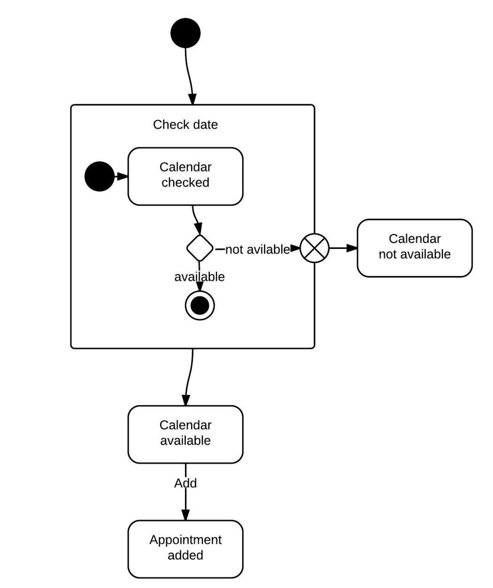

# Diagramme d'État : représentation des états et transitions

## Le diagramme d'état

Le diagramme d'état est un outil de modélisation puissant dans le langage UML (Unified Modeling Language) qui permet de représenter les différents états qu'un objet peut prendre au cours de son cycle de vie, ainsi que les transitions entre ces états. Ce diagramme met en évidence la dynamique du comportement d'un objet en illustrant comment il réagit aux événements et comment il évolue d'un état à un autre.

### États

Les états, au sein d'un diagramme d'état en UML, servent à représenter les différentes conditions ou situations dans lesquelles un objet peut se trouver à un moment précis. Chaque état est généralement visualisé par un rectangle avec un nom évocateur. Prenons l'exemple d'un processus de réservation de vol. Dans ce contexte, les états pourraient inclure "En Attente", "Confirmé", "Annulé", etc. Chaque objet, lorsqu'il est observé, est dans un et un seul état à la fois, reflétant ainsi son état actuel.

### Transitions

Les transitions, quant à elles, décrivent les chemins ou les voies par lesquels un objet évolue d'un état à un autre en réponse à des événements spécifiques. Ces transitions, représentées par des flèches dirigées entre les rectangles des états, permettent de visualiser comment un objet change de comportement suite à des événements déclencheurs. Par exemple, lorsqu'un vol est réservé avec succès, une transition pourrait être définie entre l'état "En Attente" et l'état "Confirmé". Il est important de noter que certaines transitions peuvent être conditionnelles et comporter des gardes. Les gardes sont des conditions qui doivent être remplies pour que la transition puisse s'exécuter.

### Événements

Les événements constituent les déclencheurs qui engendrent des transitions entre les états d'un objet. Ils reflètent les changements dans l'environnement de l'objet ou dans son état interne. Ces événements peuvent être de nature externe, tels que des actions entreprises par des utilisateurs, des messages reçus ou des déclencheurs de système. D'autre part, ils peuvent également être internes, comme des temporisateurs ou des processus intrinsèques provoquant des changements d'état. Par exemple, dans le contexte d'un système de réservation de vol, un événement pourrait être "Réserver Vol", déclenché par un utilisateur.

### Scénarios d'Interaction

Les scénarios d'interaction dépeignent comment un objet évolue à travers divers états en réponse à des événements particuliers. Dans le cas du processus de réservation de vol, un scénario pourrait se dérouler de la manière suivante :

    1. L'objet est dans l'état "En Attente".
    2. L'utilisateur déclenche l'événement "Réserver Vol".
    3. L'objet effectue la transition vers l'état "Confirmé".

Ces scénarios d'interaction mettent en lumière la séquence des états parcourus par un objet suite à des événements spécifiques. Ils fournissent une vision claire et compréhensible du comportement dynamique de l'objet au fil du temps et des influences extérieures ou intérieures.

## Diagramme d'état vs machine à états

Le **Diagramme d'État** est souvent employé pour modéliser le comportement d'un objet individuel, offrant une vue détaillée de la façon dont cet objet répond aux événements et évolue entre différents états. Il sert à représenter la dynamique d'un objet spécifique au fur et à mesure de son cycle de vie. Dans un diagramme d'état, on peut observer les états dans lesquels un objet peut se trouver, les transitions entre ces états, ainsi que les événements qui déclenchent ces transitions. Ce type de diagramme met en avant le comportement spécifique d'un objet en mettant l'accent sur ses changements d'état.

D'un autre côté, une **Machine à États** est une représentation plus complexe qui intègre plusieurs diagrammes d'état pour modéliser le comportement d'un système plus vaste. Contrairement au diagramme d'état qui se concentre sur un objet individuel, la machine à états peut décrire le comportement d'un système dans son ensemble, y compris la gestion des interactions entre plusieurs objets et leurs transitions d'état. Une machine à états est particulièrement utile lorsque vous voulez modéliser des interactions complexes et des scénarios où plusieurs objets interagissent et influencent mutuellement leurs états. Elle offre une vue globale du comportement dynamique d'un système, au-delà de la perspective limitée à un seul objet.

En somme, le diagramme d'état est plus spécifique et ciblé, idéal pour modéliser le comportement d'un objet particulier, tandis que la machine à états est plus holistique, adaptée pour capturer le comportement global d'un système impliquant plusieurs objets et leurs interactions.

## Représentation visuelle 

## Exemples de diagramme Etats 

## Titre du TP : Modélisation d'un Système de Réservation de Vols en Utilisant les Diagrammes d'État

**Objectif :** Créer des diagrammes d'état pour un système de réservation de vols en ligne en utilisant le plugin UMLet pour Visual Studio.

**Durée :** 2 heures

### Instructions :

### Étape 1 : Modélisation des Scénarios d'Interaction

**Analyse des Exigences :** Imaginez un système de réservation de vols en ligne. Le système permet aux utilisateurs de rechercher des vols, de réserver des billets et de gérer leurs réservations.

1. Identifiez les scénarios d'interaction clés, tels que "Rechercher un Vol", "Réserver un Billet", "Gérer une Réservation", etc.

### Étape 2 : Création des Diagrammes d'État

1. Ouvrez Visual Studio avec le plugin UMLet installé.
2. Créez un projet pour le système de réservation de vols.
3. Dans le projet, créez un diagramme d'état pour chaque scénario d'interaction identifié.
4. Identifiez les objets impliqués dans chaque scénario et créez des états pour chacun de ces objets.
5. Créez des transitions entre les états pour montrer comment les objets évoluent en réponse aux événements.

### Étape 3 : Modélisation des Fragments

1. Identifiez les parties conditionnelles, optionnelles ou répétitives de chaque scénario.
2. Utilisez les états alternatifs pour modéliser les variations dans les scénarios.

### Étape 4 : Documentation et Explication

1. Ajoutez des descriptions brèves pour chaque scénario d'interaction pour expliquer son objectif.
2. Utilisez des commentaires ou des notes pour clarifier des parties du diagramme qui nécessitent des explications supplémentaires.

### Étape 5 : Révision et Validation

1. Passez en revue vos diagrammes d'état pour vous assurer qu'ils reflètent correctement les transitions entre les états en réponse aux événements.
2. Assurez-vous que les noms des objets, des états et des transitions sont appropriés et compréhensibles.

### Étape 6 : Présentation et Discussion

1. Présentez vos diagrammes d'état aux autres étudiants, en expliquant les choix que vous avez faits pour les objets, les états, les transitions, les fragments, etc.
2. Engagez une discussion sur l'importance de la modélisation des états pour comprendre le comportement dynamique d'un système logiciel.
