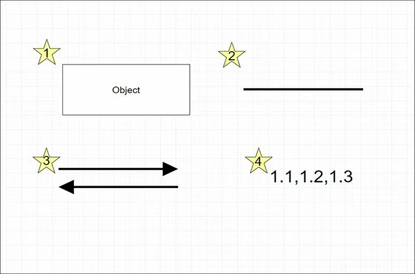
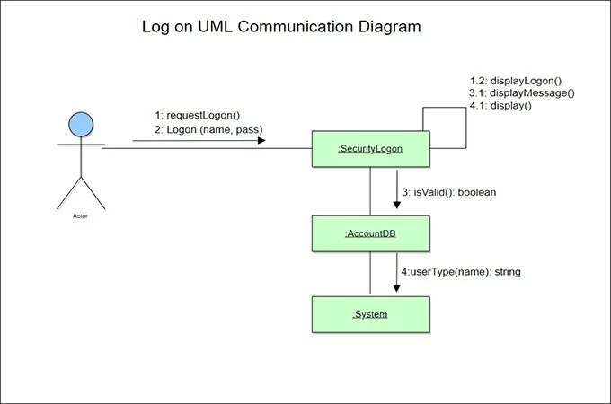
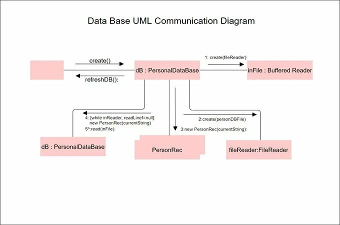
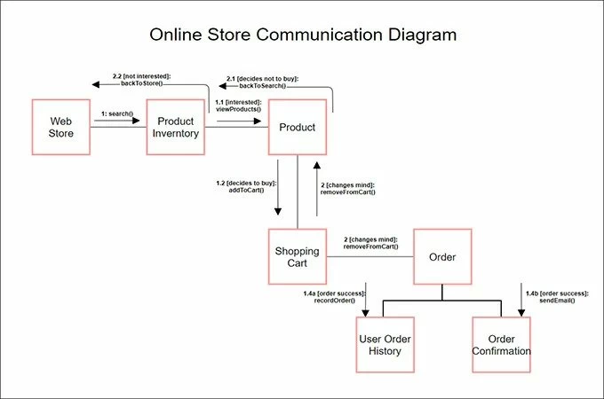

# Diagramme de communication

## Diagramme de Communication

Le diagramme de communication est un outil visuel puissant du langage UML (Unified Modeling Language) utilisé pour modéliser les interactions entre différents objets d'un système logiciel. Ce diagramme met l'accent sur les communications et les collaborations entre les objets pour représenter comment ils échangent des messages pour accomplir des tâches spécifiques.

### Communications et Collaborations

Les diagrammes de communication permettent de capturer les scénarios d'interaction dynamique entre les objets d'un système. Ils mettent en évidence les échanges de messages entre les objets au fil du temps, illustrant comment les objets collaborent pour atteindre des objectifs communs. Dans un diagramme de communication, les objets sont représentés par des rectangles et les communications entre les objets sont symbolisées par des flèches.

### Utilisation du Diagramme de Communication

La création d'un diagramme de communication implique plusieurs étapes clés pour représenter efficacement les interactions entre les objets :

1. **Identification des Objets :** Analysez le système pour identifier les objets clés qui interagissent les uns avec les autres. Ces objets peuvent être des entités, des composants, des modules, etc.

2. **Création des Objets :** Dans le diagramme de communication, créez des rectangles pour chaque objet identifié. Nommez chaque rectangle avec le nom approprié de l'objet.

3. **Séquence des Communications :** Placez les objets sur le diagramme selon la séquence dans laquelle ils échangent des messages. L'ordre vertical des objets reflète la chronologie des communications.

4. **Ajout de Messages :** Utilisez des flèches dirigées pour représenter les messages échangés entre les objets. Chaque flèche est étiquetée avec le nom du message. Indiquez la direction de l'échange de message, de l'expéditeur au destinataire.

5. **Notations Optionnelles :** Vous pouvez ajouter des numéros de séquence pour indiquer l'ordre chronologique des messages et des lignes de vie pour montrer la durée de vie des objets.

6. **Inclusion de Fragments :** Si nécessaire, utilisez des fragments pour représenter des parties conditionnelles ou répétitives des interactions.

7. **Documentation :** Ajoutez des commentaires ou des notes pour expliquer des parties du diagramme qui nécessitent des clarifications supplémentaires.

### Exemple :

Supposons un scénario d'interaction où un utilisateur recherche un vol et effectue une réservation en ligne :

1. L'objet "Utilisateur" envoie un message "Rechercher Vol" à l'objet "Système de Réservation".
2. Le "Système de Réservation" communique avec l'objet "Base de Données" en envoyant un message "Recherche en Base de Données".
3. Le résultat de la recherche est renvoyé au "Système de Réservation".
4. Le "Système de Réservation" envoie les détails du vol au "Utilisateur" en utilisant le message "Détails de Vol".
5. Si l'utilisateur souhaite réserver le vol, il envoie un message "Réserver Vol" au "Système de Réservation".

Ce scénario pourrait être représenté sous forme d'un diagramme de communication, mettant en évidence les échanges de messages entre les objets "Utilisateur", "Système de Réservation" et "Base de Données".

En utilisant le diagramme de communication, les interactions entre les objets deviennent plus claires et offrent une perspective dynamique essentielle pour comprendre le fonctionnement interne d'un système logiciel.

## Représentation visuelle 

source : https://gitmind.com/fr/diagramme-communication-uml.html 

Comme tout autre diagramme, le diagramme de communication UML comporte également plusieurs composants qui constituent son intégralité. La bonne chose à propos de ce schéma est qu’il peut être réalisé avec seulement quelques composants. Cependant, même si c’est simple, ce n’est toujours rien si vous ne savez pas ce que représentent chacun des composants. Sur cette note, voici quelques-uns des éléments les plus courants que vous rencontrerez lors de la lecture de ce type de diagramme.

* Rectangle : Ce symbole représente les objets dans l’application. En résumé, ce sont eux qui communiquent pour exécuter des ordres ou maintenir l’application ou le système fonctionnel.
* Lignes : Cet élément du diagramme de communication dirige le flux de messages au sein du système. En dehors de cela, il montre également la relation entre les objets au sein du système.
* Flèches : Ce composant indique la direction dans laquelle le message circule.
* Nombre : Les nombres présents dans ce type de diagramme représentent l’ordre dans lequel les messages sont envoyés.

## Exemple diagramme de communication 

source : https://gitmind.com/fr/diagramme-communication-uml.html

# Titre du TP : Modélisation d'un Système de Réservation de Vols en Utilisant les Diagrammes de Communication

**Objectif :** Créer des diagrammes de communication pour un système de réservation de vols en ligne en utilisant le plugin UMLet pour Visual Studio.

**Durée :** 2 heures

## Instructions :

### Étape 1 : Modélisation des Scénarios d'Interaction

1. **Analyse des Exigences :** Imaginez un système de réservation de vols en ligne. Le système permet aux utilisateurs de rechercher des vols, de réserver des billets et de gérer leurs réservations.
2. **Identification des Scénarios :** Identifiez les scénarios d'interaction clés, tels que "Rechercher un Vol", "Réserver un Billet", "Gérer une Réservation", etc.

### Étape 2 : Création des Diagrammes de Communication

1. Ouvrez Visual Studio avec le plugin UMLet installé.
2. Créez un projet pour le système de réservation de vols.
3. Dans le projet, créez un diagramme de communication pour chaque scénario d'interaction identifié.**
4. Identifiez les participants (acteurs et objets) impliqués dans chaque scénario.
5. Créez des lignes de vie pour chaque participant sur le diagramme de communication.
6. Ajoutez des messages pour représenter les interactions entre les participants. Utilisez des flèches pour montrer l'envoi et la réception de messages.

### Étape 3 : Modélisation des Fragments

1. Identifiez les parties conditionnelles, optionnelles ou répétitives de chaque scénario.
2. Utilisez les fragments "alt" (Alternative), "opt" (Option), "loop" (Boucle) pour modéliser les variations dans les scénarios.**

### Étape 4 : Documentation et Explication

1. Ajoutez des descriptions brèves pour chaque scénario d'interaction pour expliquer son objectif.
2. Utilisez des commentaires ou des notes pour clarifier des parties du diagramme qui nécessitent des explications supplémentaires.

### Étape 5 : Révision et Validation

1. Passez en revue vos diagrammes de communication pour vous assurer qu'ils reflètent correctement les interactions entre les participants en réponse aux événements.
2. Assurez-vous que les noms des participants, des messages et des fragments sont appropriés et compréhensibles.**

### Étape 6 : Présentation et Discussion

1. Présentez vos diagrammes de communication aux autres étudiants, en expliquant les choix que vous avez faits pour les participants, les messages, les fragments, etc.
2. Engagez une discussion sur l'importance de la modélisation des communications pour comprendre les interactions entre les participants dans un système logiciel.
