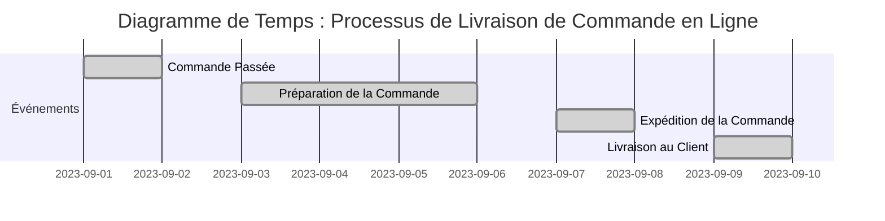
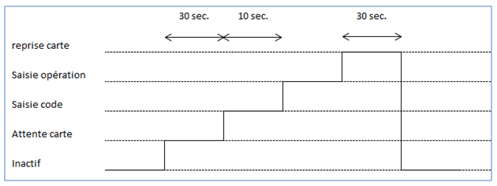
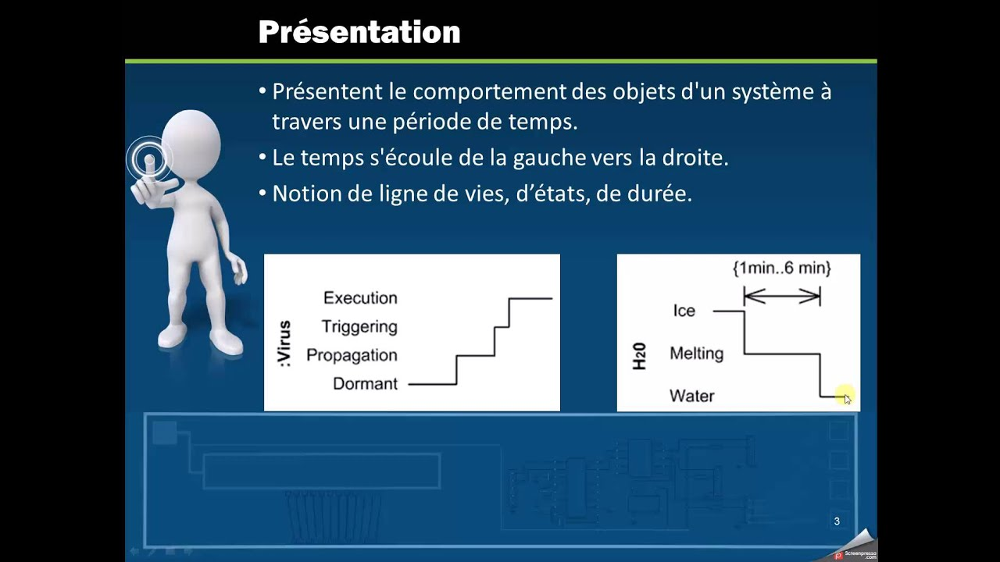
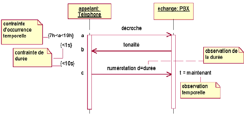

### 3. Diagramme de Temps : Modélisation des Contraintes Temporelles

Le diagramme de temps est un outil de modélisation au sein du langage UML (Unified Modeling Language) qui permet de représenter et de visualiser les contraintes temporelles et les séquences d'événements dans un système. Il est particulièrement utile pour montrer comment les interactions entre objets se déroulent dans le temps. Dans cette section, nous explorerons les principaux concepts du diagramme de temps ainsi que son utilisation dans la modélisation des contraintes temporelles.

#### Événements, Durées et Intervals :

- **Événements :** Les événements marquent des points spécifiques dans le temps où quelque chose se produit. Ils peuvent être des événements internes tels que la fin d'un processus ou des événements externes tels que l'arrivée d'un signal. Les événements sont représentés par des points dans le diagramme de temps.

- **Durées :** Les durées indiquent la période de temps pendant laquelle un événement se produit. Elles sont représentées par des barres horizontales sur le diagramme de temps. Les durées sont utiles pour montrer la durée entre les événements ou l'intervalle pendant lequel quelque chose se produit.

- **Intervals :** Les intervalles représentent une période de temps entre deux événements. Ils sont délimités par deux lignes verticales qui encadrent les durées et les événements compris dans l'intervalle.

#### Utilisation du Diagramme de Temps :

Le diagramme de temps est utilisé pour modéliser les contraintes temporelles dans un système et pour visualiser la séquence d'événements au fil du temps. Voici comment créer un diagramme de temps :

1. **Identifiez les Événements :** Identifiez les événements clés dans le système que vous souhaitez modéliser. Il peut s'agir d'événements internes aux objets ou d'événements externes déclenchés par des acteurs.

2. **Définissez les Durées :** Déterminez les durées entre les événements pour montrer la période de temps pendant laquelle chaque événement se produit.

3. **Créez les Intervals :** Utilisez des intervalles pour encadrer les événements et les durées. Cela vous permettra de visualiser comment les événements se succèdent dans le temps.

4. **Ajoutez des Contraintes Temporelles :** Si nécessaire, vous pouvez ajouter des contraintes temporelles pour spécifier des conditions ou des délais entre les événements.

5. **Réalisez le Diagramme :** Utilisez les symboles appropriés pour représenter les événements, les durées et les intervalles sur le diagramme de temps.

6. **Documentez et Expliquez :** Ajoutez des annotations pour expliquer les événements, les durées et les contraintes temporelles. Assurez-vous que le diagramme est clair et compréhensible.

#### Exemple de Scénario avec un Diagramme de Temps :

**Scénario :** Processus de Livraison de Commande en Ligne

**Événements :** 
- Commande Passée (T1)
- Préparation de la Commande (T2)
- Expédition de la Commande (T3)
- Livraison au Client (T4)

**Durées :** 
- T1 à T2 : 1 jour
- T2 à T3 : 3 jours
- T3 à T4 : 2 jours

**Diagramme de Temps :**

*Note :* Ce diagramme de temps illustre le processus de livraison d'une commande en ligne, montrant les durées entre les événements clés.

## Représentation visuelle et exemples : 

source : https://jmbruel.github.io/MobileModeling2016-2/concept.html

source : https://www.youtube.com/watch?v=K_RD307O4Co

source : https://www.researchgate.net/figure/Modelisation-du-temps-dans-les-diagrammes-de-sequence_fig2_233867718

## TP : Modélisation d'un Système de Réservation de Vols en Utilisant les Diagrammes de Temps

**Objectif :** Créer des diagrammes de temps pour un système de réservation de vols en ligne en utilisant le plugin UMLet pour Visual Studio.

**Durée :** 2 heures

### Instructions :

#### Étape 1 : Modélisation des Scénarios d'Interaction

**Analyse des Exigences :** Imaginez un système de réservation de vols en ligne. Le système permet aux utilisateurs de rechercher des vols, de réserver des billets et de gérer leurs réservations.

- Identifiez les scénarios d'interaction clés, tels que "Rechercher un Vol", "Réserver un Billet", "Gérer une Réservation", etc.

#### Étape 2 : Création des Diagrammes de Temps

1. Ouvrez Visual Studio avec le plugin UMLet installé.
2. Créez un projet pour le système de réservation de vols.
3. Pour chaque scénario d'interaction identifié, créez un diagramme de temps.
4. Identifiez les événements impliqués dans chaque scénario, tels que "Recherche de Vol", "Réservation de Billet", "Gestion de Réservation", etc.
5. Définissez les durées entre les événements pour montrer la période de temps pendant laquelle chaque événement se produit.
6. Créez des intervalles pour montrer comment les événements se succèdent dans le temps.

#### Étape 3 : Modélisation des Contraintes Temporelles

- Identifiez les parties du scénario où des contraintes temporelles sont importantes.
- Utilisez des annotations ou des notes pour ajouter des contraintes temporelles aux événements ou aux intervalles si nécessaire.

#### Étape 4 : Documentation et Explication

1. Ajoutez des descriptions brèves pour chaque scénario d'interaction pour expliquer son objectif.
2. Utilisez des commentaires ou des notes pour clarifier des parties du diagramme qui nécessitent des explications supplémentaires.

#### Étape 5 : Révision et Validation

- Passez en revue vos diagrammes de temps pour vous assurer qu'ils reflètent correctement les contraintes temporelles et les séquences d'événements.
- Assurez-vous que les noms des événements et des intervalles sont appropriés et compréhensibles.

#### Étape 6 : Présentation et Discussion

1. Présentez vos diagrammes de temps aux autres étudiants, en expliquant les choix que vous avez faits pour les événements, les intervalles, les contraintes temporelles, etc.
2. Engagez une discussion sur l'importance de la modélisation des temps pour comprendre la séquence temporelle des événements dans un système logiciel.
