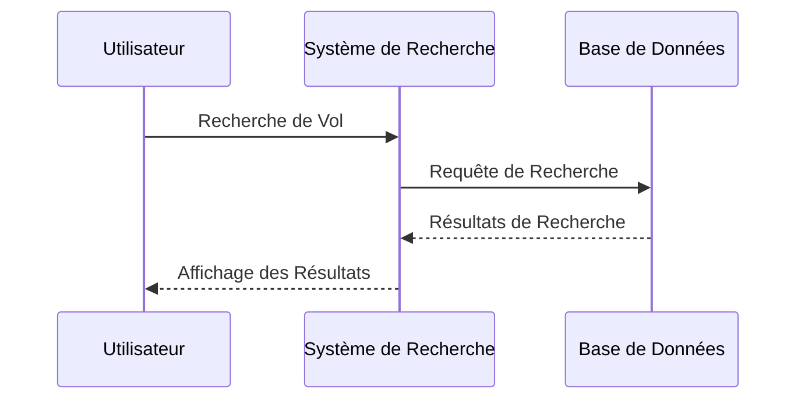

# Titre du TP : Modélisation d'un Système de Réservation de Vols en Utilisant les Diagrammes de Communication

**Objectif :** Créer des diagrammes de communication pour un système de réservation de vols en ligne en utilisant le plugin UMLet pour Visual Studio.

**Durée :** 2 heures

## Instructions :

### Étape 1 : Modélisation des Scénarios d'Interaction

1. **Analyse des Exigences :** Imaginez un système de réservation de vols en ligne. Le système permet aux utilisateurs de rechercher des vols, de réserver des billets et de gérer leurs réservations.
2. **Identification des Scénarios :** Identifiez les scénarios d'interaction clés, tels que "Rechercher un Vol", "Réserver un Billet", "Gérer une Réservation", etc.

### Étape 2 : Création des Diagrammes de Communication

1. Ouvrez Visual Studio avec le plugin UMLet installé.
2. Créez un projet pour le système de réservation de vols.
3. Dans le projet, créez un diagramme de communication pour chaque scénario d'interaction identifié.
4. Identifiez les participants (acteurs et objets) impliqués dans chaque scénario.
5. Créez des lignes de vie pour chaque participant sur le diagramme de communication.
6. Ajoutez des messages pour représenter les interactions entre les participants. Utilisez des flèches pour montrer l'envoi et la réception de messages.

### Étape 3 : Modélisation des Fragments

1. Identifiez les parties conditionnelles, optionnelles ou répétitives de chaque scénario.
2. Utilisez les fragments "alt" (Alternative), "opt" (Option), "loop" (Boucle) pour modéliser les variations dans les scénarios.

### Étape 4 : Documentation et Explication

1. Ajoutez des descriptions brèves pour chaque scénario d'interaction pour expliquer son objectif.
2. Utilisez des commentaires ou des notes pour clarifier des parties du diagramme qui nécessitent des explications supplémentaires.

### Étape 5 : Révision et Validation

1. Passez en revue vos diagrammes de communication pour vous assurer qu'ils reflètent correctement les interactions entre les participants en réponse aux événements.
2. Assurez-vous que les noms des participants, des messages et des fragments sont appropriés et compréhensibles.

### Étape 6 : Présentation et Discussion

1. Présentez vos diagrammes de communication aux autres étudiants, en expliquant les choix que vous avez faits pour les participants, les messages, les fragments, etc.
2. Engagez une discussion sur l'importance de la modélisation des communications pour comprendre les interactions entre les participants dans un système logiciel.

---

## Exemple de Diagramme de Communication : Scénario "Rechercher un Vol"

Participants : Utilisateur, Système de Recherche, Base de Données

*Scénario :* L'utilisateur effectue une recherche de vol. Le système de recherche envoie une requête à la base de données, qui renvoie les résultats de recherche au système de recherche. Le système de recherche affiche ensuite les résultats à l'utilisateur.